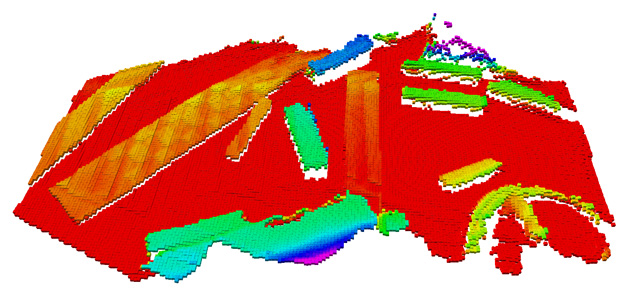

# Package Name

## Overview

This is a template: replace, remove, and add where required. Describe here what this package does and what it's meant for in a few sentences.

**Keywords:** example, package, template

### License

The source code is released under a [TODO: Add License]().

**Author: Miro Voellmy 
Affiliation: [European Space Agency](https://www.esa.int/) 
Maintainer: Miro Voellmy, miro.voellmy@esa.com**

The PACKAGE NAME package has been tested under [ROS2] Eloquent and Ubuntu 18.04. This is research code, expect that it changes often and any fitness for a particular purpose is disclaimed.

### Publications

If you use this work in an academic context, please cite the following publication(s):

* P. Fankhauser, M. Bloesch, C. Gehring, M. Hutter, and R. Siegwart: **PAPER TITLE**. IEEE/RSJ International Conference on Intelligent Robots and Systems (IROS), 2015. ([PDF](http://dx.doi.org/10.3929/ethz-a-010173654))

        @inproceedings{Fankhauser2015,
            author = {Fankhauser, P\'{e}ter and Hutter, Marco},
            booktitle = {IEEE/RSJ International Conference on Intelligent Robots and Systems (IROS)},
            title = {{PAPER TITLE}},
            publisher = {IEEE},
            year = {2015}
        }

## Installation

### Installation from Packages

To install all packages from the this repository as Debian packages use

    sudo apt-get install ros-eloquent-...

### Building from Source

#### Dependencies

- [Robot Operating System (ROS)](http://wiki.ros.org) (middleware for robotics),
- [Eigen] (linear algebra library)

		sudo apt-get install libeigen3-dev
- ([rover_msgs]) (message definitions for ESA-PRL rovers)

#### Building

To build from source, clone the latest version from this repository into your ros2 workspace and compile the package using

	cd ros2_ws/src
	git clone https://github.com/esa-prl/ros2_best_practices.git
	cd ../
	colcon build

### Unit Tests
TODO: Write exampl tests.

Run the unit tests with

	catkin_make run_tests_ros_package_template

## Usage

Describe the quickest way to run this software, for example:

Run the main node with

	ros2 launch ros2_package_template ros_package_template.launch.py

## Config files

Config file folder/set 1

* **config_file_1.yaml** Shortly explain the content of this config file

Config file folder/set 2

* **...**

## Launch files

* **launch_file_1.launch.py:** shortly explain what is launched (e.g standard simulation, simulation with gdb,...)

    Argument set 1

    - **`argument_1`** Short description (e.g. as commented in launch file). Default: `default_value`.

    Argument set 2

    - **`...`**

* **...**

## Nodes

### ros2_package_template

Reads temperature measurements and computes the average.

#### Subscribed Topics

* **`/temperature`** ([sensor_msgs/Temperature])

	The temperature measurements from which the average is computed.

#### Published Topics

...

#### Service Servers

* **`get_average`** ([std_srvs/Trigger])

	Returns information about the current average. For example, you can trigger the computation from the console with

		ros2 service call /ros_package_template/get_average

#### Service Clients

* **`stop_measurement`** ([std_srvs/Trigger])
    Sends a request to stop the temperature measurement. The related service server must be implemented by another node.

#### Parameters

* **`subscriber_topic`** (string, default: "/temperature")

	The name of the input topic.

* **`cache_size`** (int, default: 200, min: 0, max: 1000)

	The size of the cache.

### NODE_B_NAME

...

## Bugs & Feature Requests

Please report bugs and request features using the github issue tracker.

[ROS2]: http://www.ros.org
[rover_msgs]: https://github.com/esa-prl/rover_msgs
[rviz]: http://wiki.ros.org/rviz
[Eigen]: http://eigen.tuxfamily.org
[std_srvs/Trigger]: http://docs.ros.org/api/std_srvs/html/srv/Trigger.html
[sensor_msgs/Temperature]: http://docs.ros.org/api/sensor_msgs/html/msg/Temperature.html
